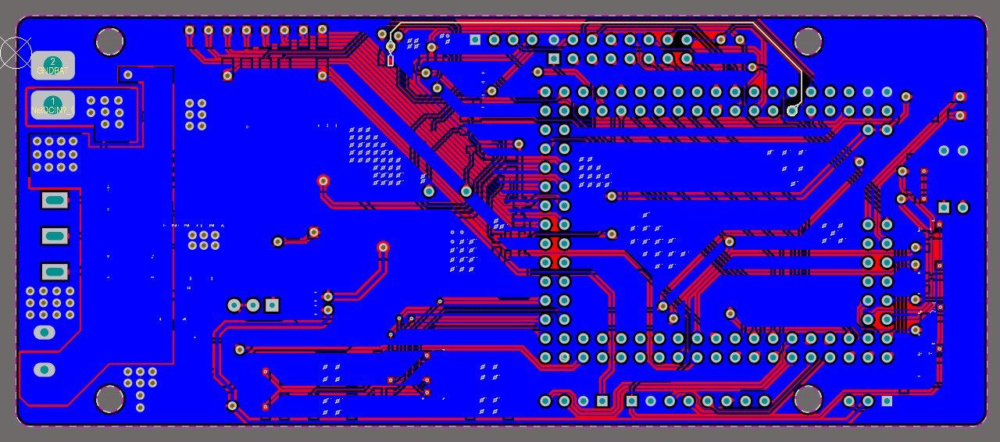
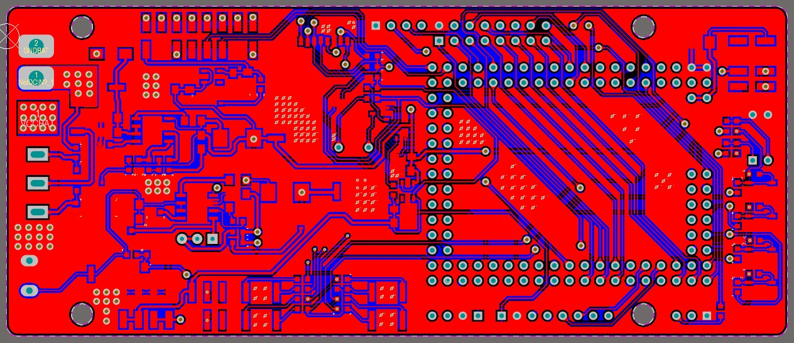
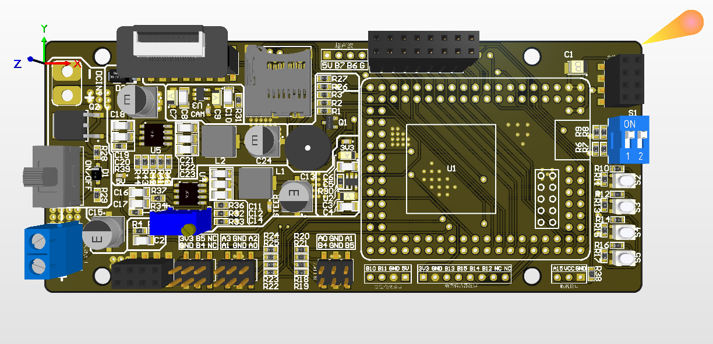
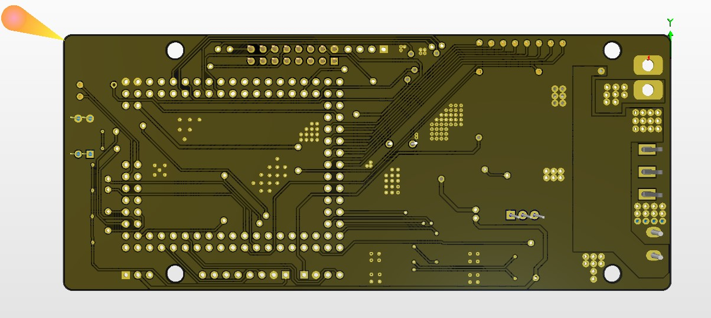

# 第十七届智能车大赛——急速越野组

## 软件：
### @基于逐飞提供的库文件开发；
### 任务进度
- [x] 电机控制
- [x] 姿态解算
- [x] 舵机PID
- [ ] 惯性导航
- [ ] Flash操作
- [ ] 打点存点
- [ ] 跑点
- [ ] 自动停机
- [ ] 超声波避障
- [x] 舵机控制

### 需要解决的问题
- [ ] 转向角度计算错误
- [ ] 踩点平均值计算逻辑错误

## 硬件
### @基于逐飞学习板开发修改完成；
### @使用了逐飞提供的封装库；
### @后期将会继续修改并更换部分原件；

### 二维：
#### 正面：

#### 反面：

### 3D：
#### 正面：

#### 反面：
