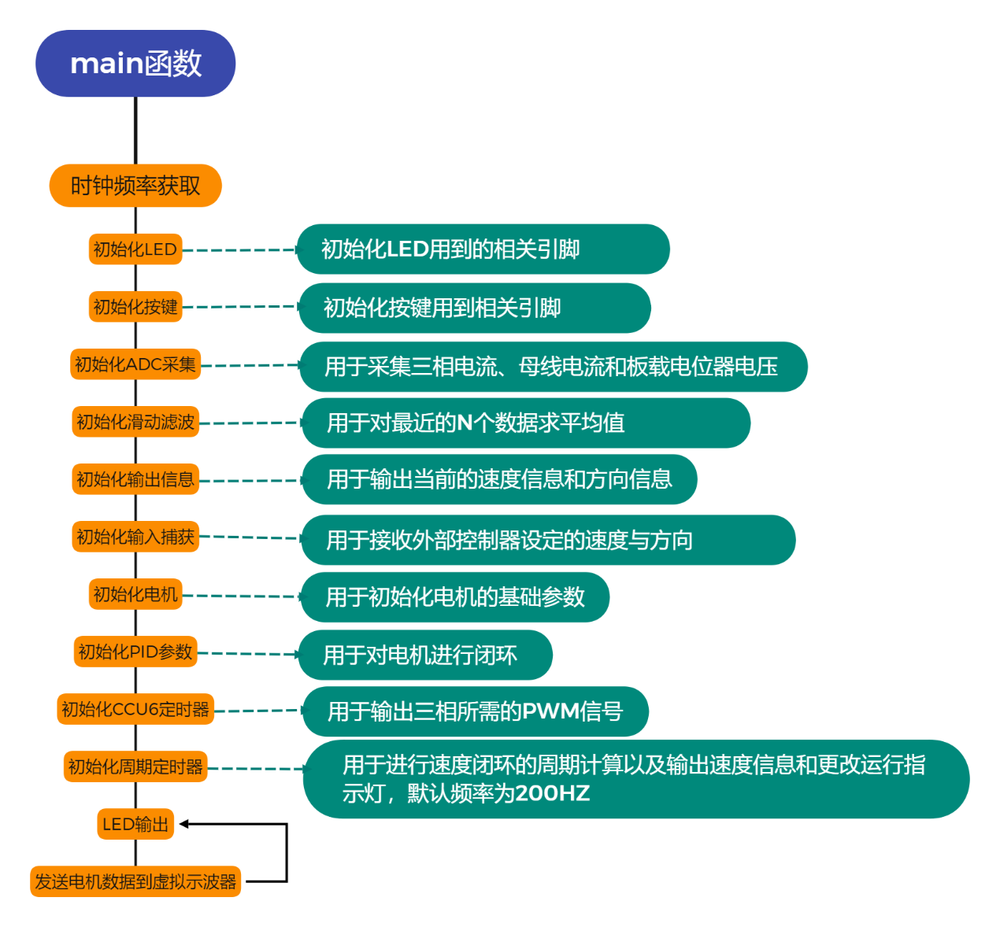
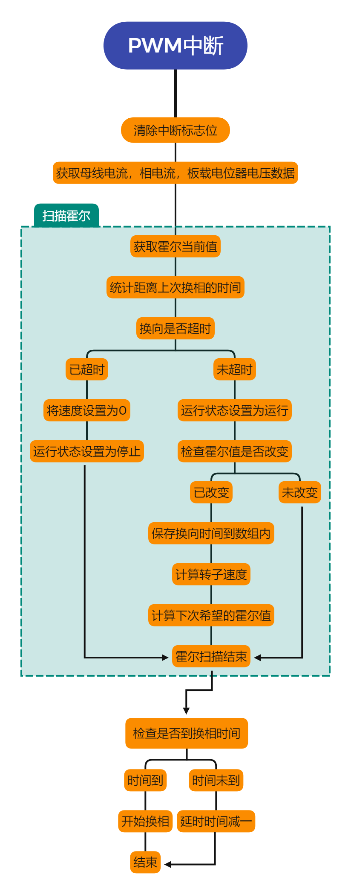
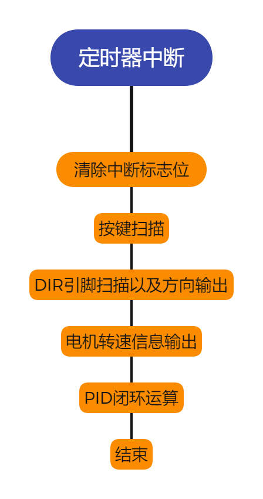
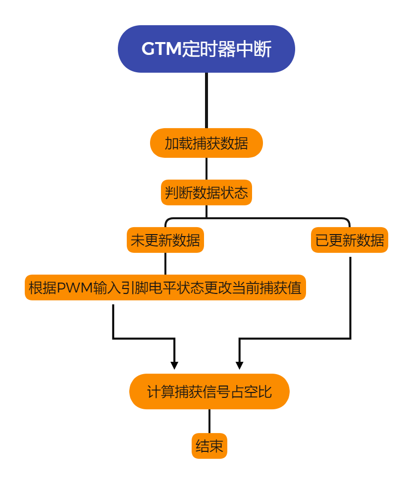

# 逐飞基于英飞凌AURIX的平衡单车组BLDC项目开源

#### 一、前言
第十七届全国大学生智能汽车竞赛已开启，根据规则，四轮摄像头组、无线充电组、平衡单车组及全模型组都需要采用英飞凌AURIX系列MCU作为主控，其中平衡单车组允许增加动量轮，动量轮允许采用无刷电机，但无刷电机的驱动需要采用基于英飞凌AURIX的无刷电机驱动方案。其中无刷电机的型号不做限制，飞轮也不做限制，甚至允许切开车模来安装动量轮。
今天下午14:00，英飞凌联合逐飞科技在B站也开展了一场直播，主要分享了英飞凌32位微控制器AURIX系列TC3XX架构简介和英飞凌无刷电机驱动方案的讲解及演示，后面也会把直播的视频放到“逐飞科技”B站账号上。“逐飞科技”B站首页链接：https://space.bilibili.com/351511552，大概明天就会上传。因为考试或其他原因没赶上今天直播的同学也可以结合回看直播视频来理解该开源项目。好吧，接下来正式开始今天的开源项目介绍。

#### 二、逐飞基于英飞凌TC264的智能车BLDC项目开源

为更好的支持大家学习无刷驱动的软、硬件方案，英飞凌及组委会委托逐飞科技为参赛同学们提供开源方案作为学习资料，将英飞凌在市场中成熟应用的电机驱动技术应用到大赛中，供大家做无刷电机驱动的设计参考，让同学们在学校中有机会了解到市场需求和相关技术。
“逐飞科技”为英飞凌官方合作伙伴，针对第十七届智能汽车竞赛平衡单车组的BLDC应用需求，为参赛选手们精心设计了符合赛事需求的Infineon BLDC驱动开源方案供大家参考，该方案使用TC264单片机，无刷电机为有感、内转子、2860KV、电压为12V。开源项目目前已实现电机正反转、内部速度闭环、支持刹车、支持堵转保护、支持速度输出。

在讲解本开源项目之前，还需要再简单科普一下无刷电机的原理，下面我们以三槽两极内转子电机进行讲解。
下图是无刷电机的基本模型示意，电机内部有三个线圈，每个线圈的一端都连接起来，另外一端引出到外部，中间有一个具有N/S两极的永磁铁内转子。

如果我们按照一定的顺序给电机通电，转子就可以旋转起来。我们举例几种给电的情况来进行简单分析和模拟：
a.给A通正电压，B通负电压。
A相产生的磁场会吸引转子的S极，B相线圈产生的磁场会吸引转子的N极，转子会转到向左倾斜的位置，如下图所示。（其中每一相产生的磁场我们需要使用右手螺旋定则判断磁场的南极与北极）

b. 给A通正电压，C通负电压。
A相产生的磁场会吸引转子的S极，C相线圈产生的磁场会吸引转子的N极，转子会转到水平位置，如下图所示。

c. 给B通正电压，C通负电压。
B相产生的磁场会吸引转子的S极，C相线圈产生的磁场会吸引转子的N极，转子会转到向右倾斜的位置，如下图所示。

d.给B通正电压，A通负电压。
B相产生的磁场会吸引转子的S极，A相线圈产生的磁场会吸引转子的N极，转子会转到向左倾斜的位置和a种情况类似但转子的南北极相反，如下图所示。

根据前四次的举例，我们可以得出第5、第6次也可以依次类推。
最终我们总结一下每次换相之后转子到达的位置，转动一圈需要换相6次，每次换相角度为60度，如下图所示

以上就是我们控制无刷电机转动的基本原理了，但是要真正的实现无刷电机的驱动，我们还缺少一个最重要的东西，就是如何知道转子已经到达预定位置，因为我们只有知道了转子到达了预定位置之后才能进行换相，这样电机才能顺滑的运转。转子位置检测常用的有三种方式。

方式一：通过过零检测，三相相电压与电机中性点电压进行比较，比较器输出的三路信号就类似于霍尔的三路信号一样。过零检测的优点在于电机与驱动连接的线较少，但是缺点在于启动的时候需要开环启动，会导致低速的时候控制效果差，并且硬件电路会更加复杂。当然也有其他办法使得在无感的方式下低速控制效果也不错，但是会大大增加软件上的复杂程度。
方式二：通过安装霍尔检测转子位置，一共安装三个霍尔分别间隔120度安装，霍尔输出的波形如下图7所示(使用逻辑分析仪采集到的波形)，每当波形改变的时候就需要进行换相。优点是电路结构简单，缺点是成本会稍微高一点点。
 

方式三：加装磁编码器直接检测转子具体的位置。这种方式成本会高很多。
我们推荐选择方式二，采用霍尔检测转子的位置信息，驱动电路硬件会稍微简单一点，成本上也并未增加太多。我们推荐的有感无刷电机就是采用这种方式，使用这种电机，还可以节省下有刷电机闭环使用到的编码器，算下来反而更实惠。这一种方式可以得到转子位置信息，我们就可以通过位置信息来编写程序进行换相，然后就可以驱动无刷电机转动了。

#### 2.2、逐飞Infineon BLDC驱动开源项目的电机控制芯片选型
经过我们和英飞凌及组委会的讨论，本次平衡单车组推荐使用英飞凌的TC264做无刷电机控制芯片，其中预驱动芯片和MOS的选型英飞凌也有推荐，可以通过英飞凌生态圈了解到。在我们前期验证时，英飞凌主任工程师Cobb Song也给了我们很大的帮助，感谢英飞凌为智能车竞赛提供的大力支持。
这款单片机特点如下：
1.使用双核TriCore™架构的高性能 32 位微控制器。
2.芯片单核主频高达 200MHz。
3.容量高至2.5MB的ROM以及高至240KB的RAM，并且都带ECC（纠错编码）
4.包含4个12位SAR ADC转换器模块。
5.拥有CCU6高级定时器，可用于输出无刷电机所需要的控制信号，支持trap信号输入,用于实现快速关闭定时器输出。
6.拥有GTM高级定时器，支持输入捕获、PWM输出等功能，可用于输出无刷电机所需要的控制信号，支持快速关断功能。并且能同步捕获霍尔信号以及外部输入的PWM信号。
7. UART 接口4 个、SPI 接口4 个。
以下几个具有特点的功能介绍下。
CCU6高级定时器：
该芯片的CCU6定时器，可以直接输出三路PWM信号或者是三路互补的PWM信号，当是互补的PWM信号时可以设置死区，并且都可以通过刹车信号来让定时器停止输出。通过三个MOS桥，我们有三种驱动方式来驱动无刷电机，方式一上桥给PWM信号下桥通过IO控制开启与关闭。方式二上桥通过IO控制开启与关闭下桥给PWM信号。方式三上下桥都给PWM信号（逐飞本次开源项目便使用的这种方式），但是需要注意的是上下桥的PWM信号必须是互补的，因为上下桥不能同时导通，否则出现电源与地短路的情况，由于MOS开关具有延时，所以互补PWM信号还必须设置死区，作用是当其中一个桥关闭之后要延时一段时间再打开另外一个桥，避免出现电源对地短路的情况。插入死区之后的互补PWM信号如下图8所示（使用逻辑分析仪采集到的波形）。

GTM高级定时器：
该芯片的GTM定时器，可以直接捕获用户输入的PWM周期以及占空比，初始化完成之后用户只需要调用底层函数即可获得输入的PWM周期和占空比。更多的功能将在以后的版本进行更新。
#### 2.3、逐飞Infineon BLDC驱动开源项目的预驱动及MOS选型
预驱我们选择了AUIRS2181，其特点是驱动能力强，输出1.9A，输入2.3A，电压范围为10-20V，且带有欠压保护，兼容3.3V和5V的输入逻辑信号。MOS管我们选择的型号是BSC014N04LS，这款MOS电流高达198A，10V的时候内阻低至1.1毫欧，开启电压低至1.2V左右，性价比较高。所以逐飞推荐的英飞凌无刷电机驱动方案的三大主要器件组成为：TC264+ AUIRS2181+BSC014N04LS，硬件电路原理图如下图9、10、11所示：

这里的图如果看不清楚不要紧，原理图的PDF文件会放到开源资料里的。
#### 2.4、逐飞Infineon BLDC驱动开源项目的代码部分

#### 2.4.1、开源项目的工程目录结构
逐飞Infineon智能车BLDC开源项目的目录结构如下图12所示。
	

	
CODE文件夹下放置的是逐飞科技精心编写的无刷电机驱动相关代码。
Infineon_libraries是英飞凌官方的底层驱动，如果还需要其他的单片机片内外设功能，可以基于Infineon_libraries自行编写程序实现。
Seekfree_libraries和seekfree_peripheral则是逐飞基于TC264制作的应用底层库。
user文件夹下放置的是主程序及中断文件。
	
#### 2.4.2、无刷电机驱动需要用到的相关内外设以及驱动代码
	

	
无刷电机需要用到的单片机片内外设有：
ADC：主要用于检测电源电压、采集放大时候的母线电流以及相电流
CCU6定时器：主要用于输出电机所需要用到的互补PWM信号，并且实现自动堵转保护，无需代码干预，当母线	电流超过设定值的时候，自动关闭定时器输出。
GPIO：主要用于LED指示灯，用于显示各种状态，并且初始化输出方向信息和速度信息的端口。
按键：通过板载的按键来改变输入来源，可在板载电位器和用户PWM信号之间切换。
PWM输入：使用GTM模块的输入捕获实现对外部PWM信号的周期以及占空比获取。

无刷电机的驱动文件有：
bldc_config.h文件用于配置电机参数，例如是否开启闭环、是否开启刹车、最大转速设置。
hall文件主要用于检测霍尔的值、换相时间计算、转速计算。
motor文件主要用于电机转动实现、占空比输出、速度和方向信息输出。
move_filter文件主要用于，对数据进行滑动平均滤波。
pid文件主要用于对转速进行速度PID闭环。
	
#### 2.4.3、主函数及中断函数说明
主函数与中断的文件存放在USER文件夹中，无刷电机大部分代码都是在中断内运行的，中断相关的函数全部放在了isr.c中。
	
#### 2.5、逐飞Infineon BLDC驱动开源项目的程序工作流程讲解
为了更清楚的表达起工作流程，整个项目的软件流程绘制了几张流程图，同时也加以文字说明。

#### 2.5.1、主函数流程图
	

	
主函数主要的作用是初始化各种外设以及一些软件资源，然后在主循环中持续的发送电机信息到虚拟示波器，便于观察电机运行情况，还根据电机运行状态来点亮和关闭故障灯及运行灯。
	
#### 2.5.2、PWM中断流程图

PWM周期中断是无刷电机的核心中断，它是由每个PWM周期结束时触发的中断，它的刷新频率就是PWM初始化时的频率。
在中断内主要是获取母线电流、相电流、板载电位器电压。母线电流在之后做电流环的时候需要使用到，也可以用于做故障检测，当检测到电流过大的时候，及时关闭输出以保护硬件，相电流可以用于之后做FOC驱动方案的时候提供支持。
扫描霍尔这个流程块中，主要是统计每次换相的时间，如果换相时间过长则认为出现故障此时应该及时关闭输出。当电机正常运行的时候将每次换相的时间都保存在数组内，当得到最近6次的换相时间之后，我们就能知道电机转动一圈所花费的时间，从而就能够计算出电机的转速了。然后根据读取到的霍尔值计算出下次期望的霍尔值。
霍尔扫描结束之后，开始检查延时换相时间是否到，时间没有到则延时时间减一，延时时间为0的时候开始进行换相动作，这里延时换相的原因是因为在电机高速运转的时候霍尔有滞后导致的，可能有人问为什么霍尔滞后了，你还要延时换相呢，因为我们采用的方法是，当霍尔出现滞后之后，我们换相的时候并不是换到下一相，而是换到了下下相，这样就相当于超前换相了，所以我们需要加一定的延时去匹配，从而得到一个最佳的换相点。

#### 2.5.3、周期定时器中断流程图
	

	
周期定时器中断频率为200Hz，主要用于根据DIR引脚设置电机是正转还是反转，然后通过SPD引脚输出电机的速度信息，这样便无需编码器也能读取到电机的当前转速。然后进行PID闭环调节，这里主要实现是将我们采集到的电机速度与设置的电机速度求差，将得到的偏差*系数KP得到比例输出Pout，然后对偏差*系数KI并将每次计算出的结果进行求和得到Iout，最终将Pout和Iout相加，然后将相加之后的值限幅之后输出到占空比寄存器驱动电机运转。其中KP、KI系数可能需要自己在多多调试，以找到更加完美的参数，使得电机运行更加迅速且稳定。
	
#### 2.5.4、GTM定时器中断流程图

GTM定时器中断主要作用是用来接收外部PWM信号的周期与高电平时间，然后计算信号的占空比，根据占空比的大小设置电机的转速，从而实现外部控制器来控制电机的转速。
逐飞会对本开源项目进行持续更新和维护，预计功能上还会继续添加串级闭环的功能、刹车力度可调节，速度环作为外环，电流环作为内环，这样可以不需要曲线计算即可实现电机缓慢加速的功能，通过内部电流环限定电流大小也能更好的保护硬件电路。之后也会继续尝试使用GTM定时器方案和FOC方案驱动电机，到时再继续和大家进行分享。当然，对这些功能有兴趣的同学可以自己主动研究尝试一下，讲真，这些东西搞明白之后，都足够找一份相对不错的工作了。
	
#### 三、逐飞制作好的参考学习驱动板及无刷电机推荐

#### 3.1、基于Infineon TC264的无刷电机驱动学习板使用简介
	

	
1.	电机驱动电源端口（不超过12V，建议使用3S电池）
2.	控制与信息输出端口，PWM引脚是速度调节端口，外部控制器输出PWM，通过调节占空比大小来调节速度。DIR引脚是用于设置电机转动方向的。SPDOUT与DIROUT引脚是输出电机转速信息的，电机转的越快此引脚上输出的信号频率越高，推荐使用单片机采集编码器的接口进行信息采集。SPDOUT连接编码器采集接口的A通道或者连接单片机的计数通道，DIROUT连接编码器采集接口的B通道或者连接方向引脚（具体可以参考编码器采集例程）。
3.	SWD调试接口，可以对电机驱动上的单片机烧写程序以及在线调试。
4.	电机驱动的使能开关，开关是连接到IO上，通过单片机硬件实现的使能。
5.	连接无刷电机霍尔接口。
6.	连接无刷电机A相。
7.	连接无刷电机B相。
8.	连接无刷电机C相。
9.	按键，用来更改输入来源，在板载电位器和用户PWM输入之间切换，也可以自己改成其他功能。
10.	板载电位器，可通过板载电位器开环测试电机。
为了测试方便，本开源项目是将TC264和驱动电路做在一个板子上的，同学们自己在做板子时可以考虑直接使用主控TC264来控制驱动输出，我们在引脚分配的时候也已经避开了常用的资源，也就是一颗TC264就既是小车的主控，也是无刷电机驱动的控制器，同时我们测试的板子是为了兼容更大的电流采用了MOS管并联，所以大家也可以根据实际需要来进行减半的设计，这样差不多就可以做到将驱动板缩小一半，以适应平衡单车组的轻量化整体设计。
温馨提示：该驱动板成品仅供学习参考调试，不能直接将成品驱动使用在正式参赛的小车上，正式参赛的无刷电机驱动板需要同学们自行制作并按要求在铜层打上队伍信息。
	
#### 3.2、无刷电机推荐
	

	
在越野组的开源方案中我们讲到过，我们对很多款电机进行了测试，单车平衡组最终采用的是和极速越野组的同一款电机，此款无刷电机力量和速度兼具，预计元旦后可以发货，逐飞推荐单车平衡组使用这款无刷电机，逐飞的开源项目代码和硬件也是以这款电机为样品来进行测试的。
这款电机的参数如下：有感、三槽两极、2860Kv（Kv表示每增加一伏电压电机增加的转速，最高12V）、尺寸36(mm)*50(mm)、额定功率190W、支持1-3S锂电池供电。

温馨提示：此款电机仅为逐飞推荐款，同学们也可以选择自己认为合适的无刷电机，这一点上规则是没有限制的，但建议大家选择有感无刷。

#### 四、全套无刷电机驱动方案的工作演示
以上开源项目经过逐飞的精心设计和代码编写，真实可靠，在今天的直播中也进行了实物演示，可以通过视直播回看查看到，视频中的飞轮自平衡系统就是用这套开源方案制作的，时间有限，并没有调试出一个最佳的效果，但足以证明此开源方案的可行性，剩下的就是大家尽情发挥自己算法的时候了。

最后，当然是上开源项目gitee链接：
https://gitee.com/seekfree/TC264_BLDC_Project

打包下载开源库压缩包，就可以愉快的开始玩无刷啦，各位下载之前别忘了帮我们点一点小星星哦，感谢各位的支持。
	

	
特别说明：该开源项目仅用于各参赛同学在设计自己的小车时进行参考，硬件和软件都不能够直接拷贝使用在自己的作品中，请大家参考后重新完成硬件和软件的设计制作。

好了，本期的开源项目介绍就到这里了，推荐款无刷电机及无刷驱动学习板已上架逐飞淘宝店预售，感谢各位支持，你们的支持是我们开源的动力，如果能帮到大家，深感荣幸。时间紧张，水平有限，大神轻拍，如果开源项目中有任何BUG，欢迎留言反馈，逐飞会持续维护和完善，也可通过QQ群与我们进行交流讨论（英飞凌平衡单车组技术支持交流群--逐飞科技：300610841）。欢迎各位持续关注“逐飞科技”微信公众号，逐飞的开源项目、技术分享及智能车竞赛的相关信息更新都会在该公众号上发布，点击下方通道即可关注。
	