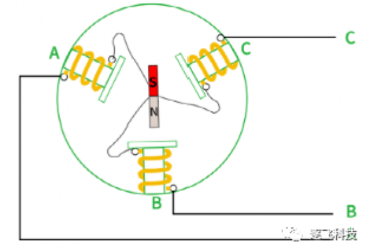
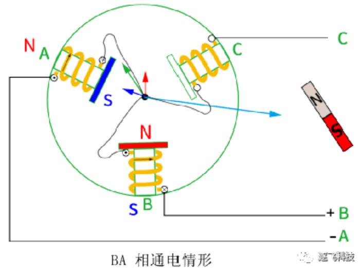
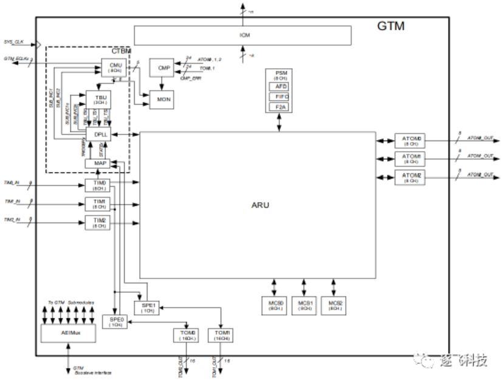
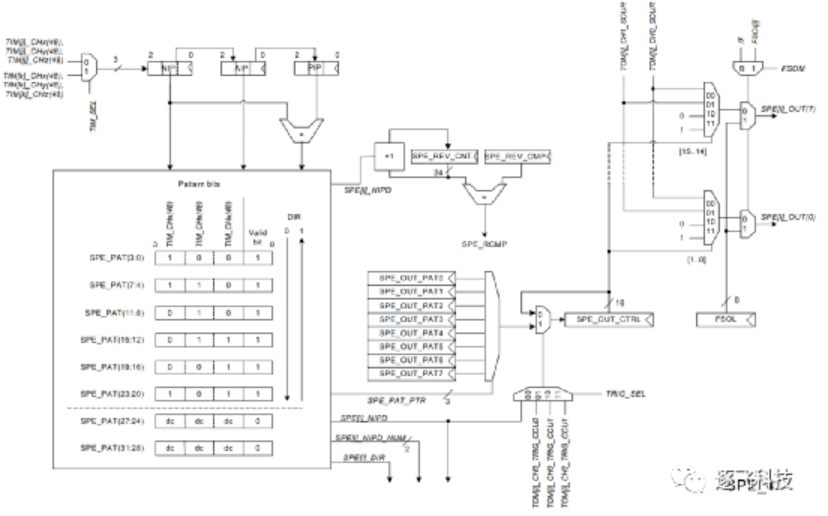
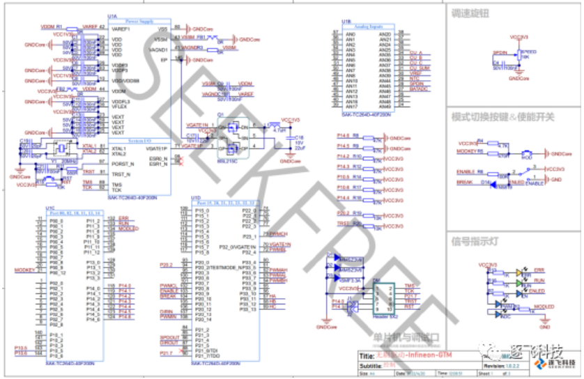
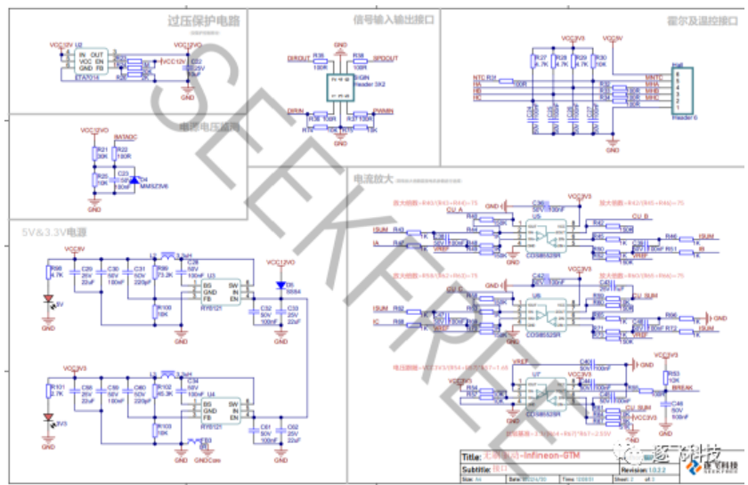
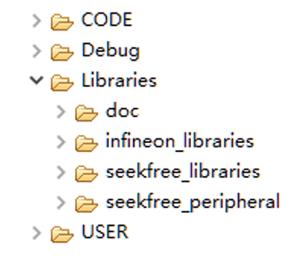
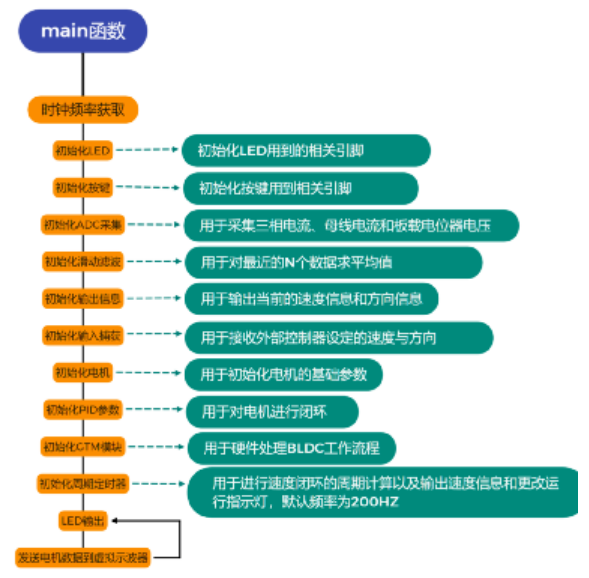
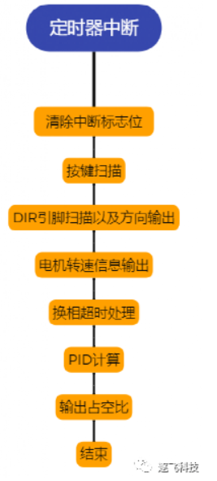
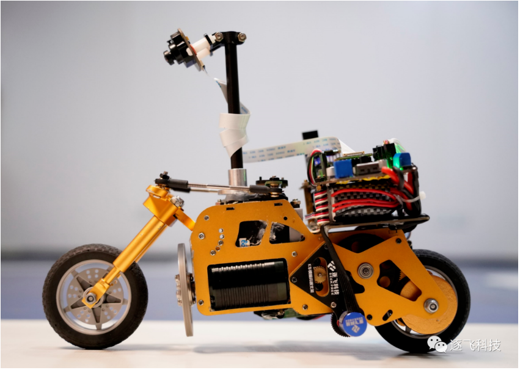

# 基于英飞凌MCU GTM模块的无刷电机驱动方案开源啦

#### 介绍
各参赛同学好，关注了逐飞科技微信公众号的同学应该还记得，受英飞凌委托，逐飞科技在2021年12月9日发布了针对第十七届无刷电机驱动的开源项目，供大家参考，相信已经有部分同学根据之前的开源方案玩起来了，还没注意到原开源项目的可以通过此篇推文进行了解，“英飞凌BLDC驱动方案开源啦--逐飞科技”可以和今天的方案进行对比穿插学习，以便达到更好的理解效果。

 在上一个项目开源后，我们又了解到不少同学都想把无刷驱动和主板合二为一，使用一颗TC264芯片来控制所有的外设，但是前段时间开源的无刷驱动项目使用的是CCU6模块，需要CPU频繁的处理无刷驱动的换相控制，所以不少同学就担心后期CPU可能会处理不过来，同时英飞凌也希望我们再制作一个基于AURIX系列MCU GTM模块的无刷驱动方案供同学们参考，于是一拍即合，今天给同学们带来了一个新的无刷驱动开源方案——基于Infineon MCU GTM的模块无刷驱动开源方案。

#### 一、无刷电机原理
自第十七届智能汽车竞赛规则发布以来，这已经是逐飞发布的第三个关于无刷驱动的开源项目了，相信参加允许使用无刷电机组别的大部分同学都已经对无刷电机的旋转原理比较熟悉啦，不过为了方便阅读，请大家允许我们在这里再简要的讲解一下无刷电机的原理部分。

#### 1.1.无刷电机内部结构

上图为无刷电机内部导线连接情况的简笔画，可以看到有三个线圈，每个线圈的一端都连接起来，另外一端引出到外部，在无刷电机的结构中我们一般称线圈的部分为定子。而中间部分则有一个具有N/S两极的永磁铁，我们一般称它为转子。大家有没有发现无刷电机中的定子和转子跟有刷电机的定子和转子的定义是不是恰恰相反呢？

#### 1.2.无刷电机旋转原理

根据无刷电机内部结构我们发现无刷电机的引出来的线有三根，而我们的电源线只有两根，那么这个时候我们将无刷电机的任意两根线与电源线连接会发生什么呢？大家看下图：

我们将电源正极接到了A相，电源负极接到了B相，此时由于无刷电机内部是一个个由相线围绕而成的线圈，那么就我们给相线通电就相对于给线圈通电了，而给线圈通电就会产生什么？没错，就是磁场！

既然产生了磁场，那么就肯定会有磁极，磁极方向的判断我们在初中阶段就有略微了解，对于这种通电线圈的磁极判断就需要用到“右手螺旋定则”，根据右手螺旋定则我们可以很轻松的判断出上图中通电线圈产生的磁场的极性：A线圈产生N极朝里S极朝外的磁场，B线圈产生S极朝里N极朝外的磁场。

而根据无刷电机的结构图我们知道无刷电机内部是有一个永磁铁作为转子的，那么此时围绕定子的线圈产生了磁场，就会迫使永磁转子改变当前的位置。我们都知道“同极相斥，异极相吸”，根据这个我们就可以判断出永磁定子被迫改变的位置如何，其实就和上面的图一致。

上面的图是电源正极接到了A相，电源负极接到了B相，我们已经分析了内部转子被迫改变位置的情况，那么如果我们反过来接呢？把电源正极接到B相，电源负极接到A相，就像下面的图一样，这个时候大家猜猜会发生什么？

对的，所有的极性相对于A正B负的时候完全交换过来了，转子也完全旋转了180°，具体的极性大家可以用右手螺旋准则判断一下，这里就不再细讲啦。

我们现在是给无刷电机的两根线通电的情况，但是无刷电机有三根线，那么我们两两通电的组合就有三种，再区分电流方向的话就有6种，那么这6种不同情况下转子的位置就和上图一样啦。

从左到右顺着排序的话，可以看出来相邻转子的角度都互差了60°，那么如果我们能使用程序来控制，按照顺序切换相线的通电情况，那么转子是不是就转起来了呢？结果也确实是这样的，但是还少了一个比较关键的东西，那就是我们应该如何检测到转子的当前角度。如果对原理还有不明白的，可以通过文章开头的超链接进入去年12月9号发布的推文，那篇文章更详细的讲解了设计原理。

#### 1.3.霍尔位置检测

无刷电机其实分为有感无刷和无感无刷，这里的有感和无感就是有没有传感器来感知转子角度的意思，但是无论是有感无刷电机还是无感无刷电机，我们都需要通过各种方法来获得转子的角度。

这里主要给大家讲的是有感无刷电机中的霍尔检测方法。

通过安装霍尔来检测转子位置，一共安装三个霍尔分别间隔120度安装，霍尔输出的波形如下图所示(使用逻辑分析仪采集到的波形)，当电机的转子位置改变的时候，就会影响霍尔元件的开关状态，从而输出高低电平。

心细的同学应该已经发现了三个霍尔的组合状态恰好是6种，而我们上面分析的通电情况也是6种，那么这两个之前是不是有对应关系呢？没错，它们就是对应的，霍尔元件是呈120度摆放的，那么霍尔的6种状态的切换间隔也是60°，恰好就与固定两相通电的转子角度对应了。

所以这个时候就可以梳理出大致的无刷电机控制原理了：

1.通过霍尔传感器检测当前转子所在的角度区间

2.通过判断当前转子角度区间来让单片机输出下一个区间的控制信号

3.控制信号通过预驱和MOS开关输出到电机

4.当转子到达下一个角度区间时，重复第一步

同样，如果对这部分也比较生疏的还是推荐去年12月9号发布的推文，里面有详细讲解。

#### 二、GTM模块介绍

#### 2.1.GTM模块简述

GTM(Generic Timer Module)，直译出来就是通用定时器模块的意思，但是它又与我们平时理解的通用定时器有点不同，我们平时用定时器无非就是用来输出PWM信号或者用于周期中断等等，这些功能GTM模块都支持，而且还有一些我们没了解过的功能，大家看下图：

这个就是GTM模块的总体框图啦，我们第一眼肯定看到的就是里面最大的模块-ARU模块，它是用来处理数据流的，并且可以控制整个GTM模块的输出，但是它不是我们今天的主角，我们的主角在ARU模块的左侧和左下部分，分别是TIM模块、SPE模块、TOM模块，这几个模块的组合实现了单片机硬件检测霍尔并且换相输出的操作，我们的CPU就不用再反复执行无刷电机驱动部分的代码了。

#### 2.2.驱动逻辑分析

在单独介绍我们要用到的这几个模块之前，我们先简单描述一下它们的工作流程。

TIM模块负责采集霍尔信号并且对其进行滤波，然后将霍尔信号送到SPE模块，SPE模块通过判断当前的霍尔值来控制TOM模块输出固定相位的PWM信号，而这个固定的相位就是我们初始化时预先在SPE模块中写好的一个换相表。具体的工作流程大家可以看看下图：

#### 2.2.1.TIM模块

TIM（Timer Input Module）模块，定时器输入模块。

在我们的实际应用中，该模块主要负责采集霍尔信号和刹车信号，同时模块自带滤波功能，保证捕获到的是准确的值。TIM模块会将捕获到的霍尔值直接送到SPE模块进行后续处理。

从上面总的工作流程图可以看出来TIM0模块的输入有8个通道，而我们只用了三个用于捕获霍尔信号，然后将处理好的三路霍尔信号送到了SPE0模块。

#### 2.2.2.SPE模块

SPE (Sensor Pattern Evaluation) 模块，传感器评估模块。

SPE模块专用于评估当前霍尔信号的值，并且根据当前的霍尔值去查表通过寄存器控制TOM模块的输出，具体控制逻辑看下图：

左上角的三路信号就是由TIM模块滤波之后送过来的信号，然后通过NIP寄存器进行保存（我们通过读取NIP寄存器就可以知道当前的霍尔值），之后三路信号分别送到了Pattern进行查表，这里的查表是查的霍尔与输出的对应关系，比如霍尔实际值是1，然后查表输出值是3，那么后面就会根据查表输出的霍尔值来再次查表输出实际PWM的控制值。上图中，SPE_PAT_PTR就是根据实际霍尔值查表输出的矫正值，而SPE_OUT_PATx是控制PWM输出的寄存器值，将SPE_OUT_PATx的值根据SPE_PAT_PTR送到SPE_OUT_CTRL寄存器，后续的输出就是判断SPE_OUT_CTRL寄存器的内容来控制不同端口的输出情况。

值得注意的是，右上角的刹车信号是通过FSOI进行控制，当FSOI为有效时，最终的输出将被修改为FSOM寄存器的输出值，而FSOM寄存器的是我们在初始化时就给了的，我们只要设置FSOM寄存器是控制所有上桥关闭、所有下桥开启，那么就是正常的刹车效果。

#### 2.2.3.TOM模块

TOM（Timer Output Module）模块，定时器输出模块。

该模块将根据设置的参数生成PWM信号，以及根据SPE模块选择的输出通道输出PWM信号或者是高低电平，从而驱动无刷电机旋转。

#### 三、硬件原理图分析

关于驱动电路的预驱动及MOS选型在之前的推文中已经讲过，这里就不再重复了，下面主要讲一下原理图中值得注意的地方，图看不清不要紧，后续会将原理图开源放到Gitee，大家可以去自行下载。

这个是TC264核心的部分外围电路，相较于之前开源的CCU6方案并未作太大改变，仅把控制输出端口、霍尔输入端口、输入捕获端等端口稍微做了修改，想要做一体板的同学也不用担心新的端口和原来的主板端口会有太多冲突，我们GTM模块所使用的引脚仅和一个编码器的端口稍有冲突，其他的完全和主板的端口避开的，所以大家完全可以放开手去做啦~

后面的电源部分、电流采集部分、预驱和MOS开关部分则是与之前的CCU6方案完全一致。所以预驱和MOS的芯片选型这里就不再赘述啦。

#### 四、程序运行流程

#### 4.1.GTM模块无刷驱动开源项目的代码部分

#### 4.1.1.开源项目的工程目录结构

逐飞Infineon智能车BLDC开源项目的目录结构如下图所示。
 

CODE文件夹下放置的是逐飞科技精心编写的无刷电机驱动相关代码。 Infineon_libraries是英飞凌官方的底层驱动，如果还需要其他的单片机片内外设功能，可以基于Infineon_libraries自行编写程序实现。 Seekfree_libraries和seekfree_peripheral则是逐飞基于TC264制作的应用底层库。 user文件夹下放置的是主程序及中断文件。

#### 4.1.2.无刷电机驱动需要用到的相关内外设以及驱动代码
 

无刷电机需要用到的单片机片内外设有： 
ADC：主要用于检测电源电压、采集放大时候的母线电流以及相电流 
GTM定时器：主要用于输出电机所需要用到的互补PWM信号，并且实现自动堵转保护，无需代码干预，当母线 电流超过设定值的时候，自动关闭定时器输出。
GPIO：主要用于LED指示灯，用于显示各种状态，并且初始化输出方向信息和速度信息的端口。 
按键：通过板载的按键来改变输入来源，可在板载电位器和用户PWM信号之间切换。
PWM输入：使用GTM模块的输入捕获实现对外部PWM信号的周期以及占空比获取。

无刷电机的驱动文件有： bldc_config.h文件用于配置电机参数，例如是否开启闭环、是否开启刹车、最大转速设置。 hall文件主要用于检测霍尔的值、换相时间计算、转速计算。 motor文件主要用于电机占空比输出、速度计算、速度和方向信息输出。 move_filter文件主要用于，对数据进行滑动平均滤波。 pid文件主要用于对转速进行速度PID闭环。

#### 4.1.3.主函数及中断函数说明

主函数与中断的文件存放在USER文件夹中，无刷电机控制部分由GTM模块硬件完成，所以并没有代码用于控制无刷电机，中断相关的函数全部放在了isr.c中。

#### 4.1.4.GTM模块无刷·驱动开源项目的程序工作流程讲解

为了更清楚的表达起工作流程，整个项目的软件流程绘制了几张流程图，同时也加以文字说明。由于主要使用的GTM模块，所以程序部分就相对比较简单了。

上图为本次开源驱动程序的主函数部分，不难看出来，处理初始化了几个无刷驱动固定的外设之后，就是GTM模块的初始化，我们在这里就把要硬件换相所使用到的TIM0模块、SPE0模块、TOM0模块都初始化一遍，初始化结束之后就已经实现硬件换相了，但是需要一个东西，那就是输出控制电机转速的占空比信息，因此最后我们还有一个固定的周期中断初始化。

在定时器周期中断的服务函数中，我们进行了一些基础的按键扫描、电机旋转方向设置等跟无刷电机相关的基础操作，然后就是进行PID闭环运算，最后就是输出占空比了，只有输出带有效占空比的PWM信号才能让无刷电机转起来。

上面基本上已经完成了无刷驱动程序的全套内容，但是还差一个，那就是输入捕获，当然了，如果是制作一体板的同学就可以不需要这部分的内容。

在分享CCU6方案时，我们就有用到输入捕获来捕获用户输入的PWM占空比信息，方便用户通过主板直接控制无刷电机旋转。同时，我们也有说到Infineon的输入捕获部分非常简单方便，仅需判断一下数据状态就可以得到捕获的占空比信息，其余的操作都已经在触发捕获中断之前完成了。

最后，当然是上开源项目gitee链接：

       https://gitee.com/seekfree/TC264_GTM_BLDC_Project

打包下载开源库压缩包，就可以愉快的开始玩无刷啦，各位下载之前别忘了帮我们点一点小星星哦，感谢各位的支持。

#### 五、结束语

为了测试方便，本开源项目的硬件依然是将TC264和驱动电路做在一个板子上的，同学们自己在做板子时可以考虑直接使用主控TC264来控制驱动输出，我们在引脚分配的时候也已经避开了常用的资源，也就是一颗TC264就既是小车的主控，也是无刷电机驱动的控制器，并且文章开头也说过，使用GTM模块来实现无刷驱动的方案也降低了CPU消耗，同时我们测试的板子是为了兼容更大的电流采用了MOS管并联，所以大家也可以根据实际需要来进行减半的设计，这样差不多就可以做到将驱动板缩小一半，并且也推荐大家用一颗TC264实现无刷驱动和主控两个需求，以适应平衡单车组的轻量化整体设计。所以本开源项目所对应的驱动板实物并未生产学习板来进行销售，目前逐飞在售的无刷驱动学习板只有CCU6的那种方案，所以同学们直接根据开源项目的原理图自行设计就行了。

无刷电机可以采用逐飞演示车模中推荐的型号，在越野组的开源方案中我们讲到过，我们对很多款电机进行了测试，单车平衡组最终采用的是和极速越野组的同一款电机，此款无刷电机力量和速度兼具，现货发售中，逐飞的开源项目代码和硬件也是以这款电机为样品来进行测试的。

这款电机的参数如下：有感、三槽两极、2860Kv（Kv表示每增加一伏电压电机增加的转速，最高12V）、尺寸36(mm)*50(mm)、额定功率190W、支持1-3S锂电池供电。

温馨提示：此款电机仅为逐飞推荐款，同学们也可以选择自己认为合适的无刷电机，这一点上规则是没有限制的，但建议大家选择有感无刷。

以上开源项目经过逐飞的精心设计和代码编写，真实可靠，在昨天的直播中也进行了讲解，可以通过逐飞B站回看视频，平衡单车组的逐飞演示车模也是用的这套开源方案制作的，证明了此开源方案的可行性，剩下的就是大家尽情发挥自己算法的时候了。学习过程中可以结合直播视频回放和往期相关推文来加深理解，链接及直播回放链接见下方：

逐飞基于英飞凌MCU CCU6的无刷电机驱动方案开源项目：英飞凌BLDC驱动方案开源啦--逐飞科技

第十七届智能车竞赛英飞凌|逐飞联合专题培训之无刷电机驱动：
       https://www.bilibili.com/video/BV1JY411p7bH?spm_id_from=333.999.0.0

第十七届智能车竞赛英飞凌|逐飞联合专题培训之平衡单车入门讲解：
       https://www.bilibili.com/video/BV1er4y1H7Wt?spm_id_from=333.999.0.0

在英飞凌无刷驱动开源项目的研发过程中，英飞凌主任工程师Cobb老师给我们提供了很多技术支持和帮助，感谢英飞凌，感谢Cobb老师，期待能与英飞凌开展更深入的合作，获得更多的学习机会。更要感谢英飞凌为智能车竞赛提供的大力支持。

好了，本期的开源项目介绍就到这里了，推荐款无刷电机、刷驱动学习板及平衡单车组学习套件均已上架逐飞淘宝店预售，感谢各位支持（seekfree.taobao.com），你们的支持是我们开源的动力，如果能帮到大家，深感荣幸。时间紧张，水平有限，大神轻拍，如果开源项目中有任何BUG，欢迎留言反馈，逐飞会持续维护和完善，也可通过QQ群与我们进行交流讨论（英飞凌平衡单车组技术支持交流群--逐飞科技：300610841）。欢迎各位持续关注“逐飞科技”微信公众号，逐飞的开源项目、技术分享及智能车竞赛的相关信息更新都会在该公众号上发布，点击下方通道即可关注。
